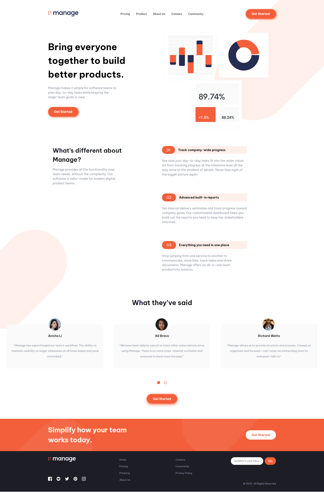

# Frontend Mentor - Manage landing page solution

This is a solution to the [Manage landing page challenge on Frontend Mentor](https://www.frontendmentor.io/challenges/manage-landing-page-SLXqC6P5). Frontend Mentor challenges help you improve your coding skills by building realistic projects.

## Table of contents

-   [Overview](#overview)
    -   [The challenge](#the-challenge)
    -   [Screenshot](#screenshot)
    -   [Links](#links)
-   [My process](#my-process)
    -   [Built with](#built-with)
    -   [What I learned](#what-i-learned)
    -   [Continued development](#continued-development)
    -   [Useful resources](#useful-resources)
-   [Author](#author)

## Overview

### The challenge

Users should be able to:

-   View the optimal layout for the site depending on their device's screen size
-   See hover states for all interactive elements on the page
-   See all testimonials in a horizontal slider
-   Receive an error message when the newsletter sign up `form` is submitted if:
    -   The `input` field is empty
    -   The email address is not formatted correctly

### Screenshot



### Links

-   Solution URL: [Github repo](https://github.com/Robertron624/manage-landing-page)
-   Live Site URL: [Netlify URL](https://chic-tiramisu-4ef70d.netlify.app/)

## My process

### Built with

-   Semantic HTML5 markup
-   CSS custom properties
-   Flexbox
-   CSS Grid
-   Mobile-first workflow
-   Vanilla Javascript
-   [Embla Carousel](https://www.embla-carousel.com/) - JS Carousel library

### What I learned

The javascript code to reinitialize the carousel when the screen size changes:

```js
const mediaQuery = window.matchMedia("(min-width: 768px)");

const paginationsDots = document.querySelector(".pagination-dots");

function handleTabletChange(e) {
    if (e.matches) {
        emblaNode.reInit({
            slidesToScroll: 3,
        });
        dots[2].remove();
        dots[3].remove();
    } else {
        emblaNode.reInit({
            slidesToScroll: 1,
        });

        if (paginationsDots.childElementCount === 2) {
            const newDots = `
                <button class="dot" id="dot-3"></button>
                <button class="dot" id="dot-4"></button>
            `;

            paginationsDots.insertAdjacentHTML("beforeend", newDots);

            dots = document.querySelectorAll(".dot");

            dots[2].addEventListener("click", dotClickCallback.bind(null, 2));
            dots[3].addEventListener("click", dotClickCallback.bind(null, 3));
        }
    }
}

mediaQuery.addEventListener("change", handleTabletChange);

handleTabletChange(mediaQuery);
```

### Continued development

I want to keep using vanilla javascript to create more projects that only require a little bit of Js, I think it's a good way to learn how to use the DOM API and how to manipulate the DOM. However, I want to use React and use it in my future complex projects.

### Useful resources

-   [Draggable & Touch-friendly Carousel In Vanilla JavaScript – embla-carousel](https://www.cssscript.com/draggable-touch-embla-carousel/) - This helped me to create a carousel with vanilla javascript, its API is very simple and easy to use.

## Author

-   Personal Website - [Robert Ramirez](https://robert-ramirez.netlify.app)
-   Frontend Mentor User- [@Robertron624](https://www.frontendmentor.io/profile/Robertron624)
-   Twitter - [@robertdowny](https://www.twitter.com/robertdowny)
